# CR-Custom-Reporting Architecture Knowledge Base

## 1. Executive summary

CR-Custom-Reporting is a prototype semantic report builder with an ASP.NET Core backend and a Next.js frontend. The backend owns SQL Server connection discovery, in-memory semantic metadata, semantic model mutation, visual query binding, logical planning, SQL compilation, execution, report execution persistence, and artifact/export generation. The frontend owns source connection workflows, semantic metadata presentation, drag-and-drop report construction, filter/sort authoring, query execution, and export initiation.

The most important architectural fact is that the query path is a staged pipeline:

```mermaid
flowchart LR
  UI[Next.js visual builder] --> API[POST /api/query/execute]
  API --> Store[ISemanticModelStore.LoadAsync]
  Store --> Bind[SemanticModelBinder.Bind]
  Bind --> Ctx[EvaluationContextBuilder.Build]
  Ctx --> Measures[MeasureExpansionEngine.Expand]
  Measures --> Rels[RelationshipTraversalEngine.Build]
  Rels --> Plan[LogicalPlanBuilder.Build]
  Plan --> SQL[SqlCompiler.Compile]
  SQL --> Exec[IQueryExecutor.ExecuteAsync]
  Exec --> Artifact[ReportArtifactBuilder + IReportArtifactStore]
```

## 2. Repository and project overview

### Folder structure

- `ReportPlatform/Report.Api`: ASP.NET Core API, controllers, startup, API-layer services, Telerik rendering/export, Power BI integration, and Swagger examples.
- `ReportPlatform/Report.Contracts`: DTOs and shared contracts for connections, metadata, visual query requests, query results, validation, semantic management, exports, and report artifacts.
- `ReportPlatform/Report.Metadata`: semantic model entities plus in-memory registries/stores for connections, datasets, reports, executions, and models.
- `ReportPlatform/Report.QueryEngine`: semantic binding, expression parsing/validation/SQL compilation, context building, relationship traversal, measure expansion, logical planning, SQL compilation, validation stages, query service orchestration, and report artifact building/loading.
- `ReportPlatform/Report.Infrastructure`: SQL Server schema discovery/execution, report execution repositories, and artifact store implementations.
- `data-report-builder`: Next.js app, React components, API clients, metadata selectors, hooks, and UI primitives.
- `docs`: supplemental Power BI lab documentation.

### Solution and build structure

The .NET solution is `ReportPlatform/ReportPlatform.slnx`. All backend projects target `net10.0`. `Report.Api` is the web host and references `Report.QueryEngine`, `Report.Contracts`, and `Report.Infrastructure`. `Report.Infrastructure` references `Report.Contracts`, `Report.Metadata`, and `Report.QueryEngine`; `Report.QueryEngine` references `Report.Contracts` and `Report.Metadata`; `Report.Metadata` references `Report.Contracts`.

The frontend is a standalone PNPM/Next.js workspace in `data-report-builder` with scripts `dev`, `build`, `start`, and `lint`.

### Deployment assumptions

- Backend default API URL used by frontend is `http://localhost:5224` unless `NEXT_PUBLIC_REPORT_API_URL` is set.
- CORS permits configured origins and, in development, localhost ports `3000` through `3009`.
- Semantic metadata, connections, datasets, and reports are in-memory by default.
- Report artifacts default to local filesystem storage unless configured for `InMemory`.
- Report execution metadata defaults to SQL Server when `ReportExecutionStore:ConnectionString` exists; otherwise it falls back to in-memory, optionally backed by local artifacts.

## 3. Technology and dependencies

### Backend

- ASP.NET Core MVC controllers, Swagger/OpenAPI, CORS, custom exception middleware.
- SQL Server access through `Microsoft.Data.SqlClient` and Dapper.
- Telerik Reporting packages for report rendering/export.
- Microsoft Identity Client and custom Power BI services for Power BI embed lab integration.
- `Microsoft.Extensions.Options` and logging abstractions for query validation/configuration.

### Frontend

- Next.js 16, React 19, TypeScript 5.7, PNPM.
- Drag and drop with `@dnd-kit`.
- Radix UI primitives and local shadcn-style UI components.
- SWR, zod, react-hook-form, sonner, recharts, lucide-react, next-themes.
- Power BI embed support through `powerbi-client`.

## 4. Dependency graphs

### Project dependency graph

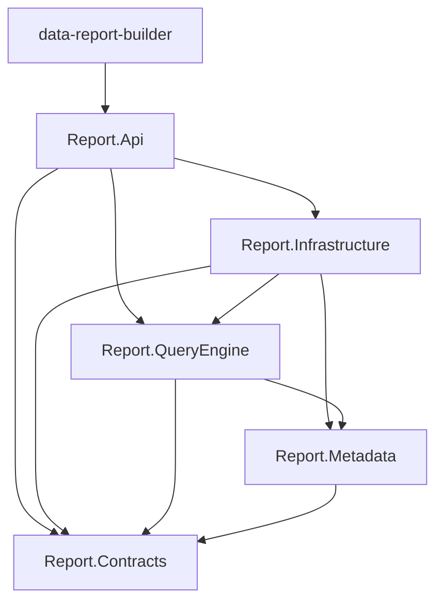

### Runtime dependency graph

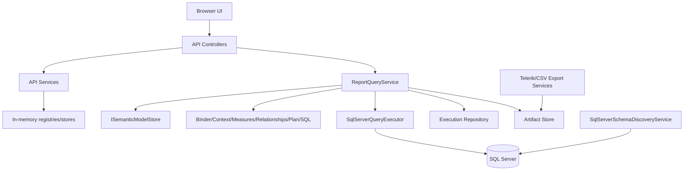

### Build dependency graph

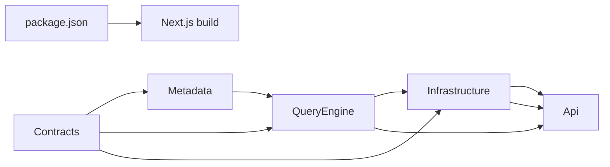

## 5. Backend architecture by project

### Report.Contracts

Purpose: shared external and internal DTO surface. It owns `VisualQueryRequest`, connection request/response DTOs, metadata DTOs, relationship DTOs, semantic mutation DTOs, validation DTOs, query results, rendered report result contracts, and report artifact/execution records.

Entry points are contract types, not services. `VisualQueryRequest` is the key query input with `connectionId`, `datasetId`, `reportId`, `visualType`, `rows`, `columns`, `values`, `filters`, `sort`, `limit`, and `offset`.

### Report.Metadata

Purpose: semantic metadata domain model and volatile registries. `SemanticModel` aggregates dataset id, connection id, database, tables, fields, metrics, relationships, and version. Fields distinguish roles such as dimension, measure candidate, derived field, and key; metrics contain formula text and base table; relationships contain table/column endpoints, join type, cardinality, cross-filter direction, active/primary flags, source, confidence, status, and warning.

Stores/registries are in-memory implementations of `IConnectionRegistry`, `IDatasetRegistry`, `IReportRegistry`, `IReportExecutionRegistry`, and `ISemanticModelStore`. This is simple and fast for development but means metadata is process-local unless persisted elsewhere.

### Report.Infrastructure

Purpose: adapters to external infrastructure. `SqlServerConnectionFactory` builds SQL Server connection strings. `SqlServerSchemaDiscoveryService` lists databases, discovers tables/columns/foreign keys, and previews table rows. `SqlServerQueryExecutor` executes compiled SQL with parameters and maps rows to `QueryResult`. Persistence classes store execution records in memory, local artifacts, or SQL Server. Artifact store classes save/load report artifacts in memory or filesystem; `S3ReportArtifactStore` is presently a fallback wrapper, not a real S3 implementation.

### Report.QueryEngine

Purpose: semantic query processing. It receives a visual query request plus a semantic model and produces validated SQL and execution results. Key components are:

- `SemanticModelBinder`: validates requested rows/values/filters/sorts against the model and resolves them to semantic objects.
- `EvaluationContextBuilder`: separates dimension filters from metric filters and carries selected group fields, measures, sort, limit, and offset.
- `MeasureExpansionEngine`: compiles metric formulas into SQL aggregate expressions.
- `RelationshipTraversalEngine`: chooses a base table and finds relationship paths for required tables.
- `LogicalPlanBuilder`: converts semantic context and join plan into a logical SQL plan with aliases, select items, joins, WHERE, HAVING, GROUP BY, ORDER BY, and paging.
- `SqlCompiler`: renders a logical plan into parameterized T-SQL.
- Validation stages: stage-specific validators for binding, context, measures, relationships, logical plan, SQL compilation, and execution.
- `ReportQueryService`: orchestrates validation, compilation, execution, artifact creation, and execution repository state transitions.

### Report.Api

Purpose: HTTP/API composition root. It registers DI services, configures Swagger, CORS, middleware, Telerik reporting services, Power BI services, in-memory registries, query engine services, SQL Server infrastructure, execution stores, and artifact stores. Controllers expose connection discovery, dataset registration/metadata, field/metric/derived-field/calculated-object mutation, relationships, query compile/execute, report definitions, report executions, exports, Telerik report services, and Power BI lab endpoints.

## 6. Application startup flow

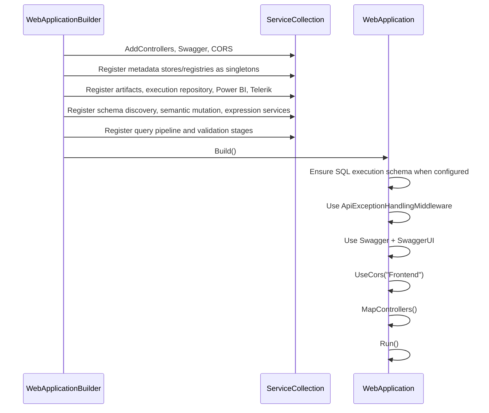

## 7. API reference and execution flows

### Connections

- `POST /api/connections/test`: accepts `TestConnectionRequest`; builds a transient `ConnectionDefinition`, opens SQL Server connection, returns success/failure and optionally stores the connection on success.
- `GET /api/connections/{connectionId}/databases`: loads a connection from `IConnectionRegistry`, then `SqlServerSchemaDiscoveryService.GetDatabasesAsync` returns databases.
- `POST /api/connections/discover`: loads or constructs a connection definition, discovers schema with tables/columns/relationships.
- `POST /api/connections/preview-table`: loads or constructs a connection definition, runs a `TOP` preview query for one table.

### Datasets and metadata

- `POST /api/datasets/register-from-tables`: stores/updates a connection, calls `SemanticMetadataGenerator.Generate`, saves the dataset in `IDatasetRegistry`, saves the semantic model in `ISemanticModelStore`, and returns dataset id plus metadata consistency diagnostics.
- `GET /api/datasets/{datasetId}/metadata`: `DatasetMetadataService.GetMetadataAsync` loads dataset and model, maps semantic tables/fields/metrics/relationships to metadata DTOs.

### Semantic management

- `GET /api/datasets/{datasetId}/fields`: lists non-derived fields from `SemanticModelMutationService`.
- `PUT /api/datasets/{datasetId}/fields/{fieldId}`: mutates display name, role, hidden/draggable, description, format string.
- `GET/POST/PUT/DELETE /api/datasets/{datasetId}/metrics`: list, validate, create, update, and delete semantic metrics.
- `GET/POST/DELETE /api/datasets/{datasetId}/derived-fields`: list, validate, create, and delete derived/calculated columns.
- `POST /api/datasets/{datasetId}/calculated-objects`: validates and creates either a metric or calculated column from one request.
- `POST /api/datasets/{datasetId}/expressions/validate`: validates expression syntax, binding, type inference, aggregation rules, and dependencies.

### Relationships

- `GET /api/datasets/{datasetId}/relationships`: lists relationships.
- `POST /api/datasets/{datasetId}/relationships`: validates endpoints and creates a manual relationship.
- `PUT /api/datasets/{datasetId}/relationships/{relationshipId}`: updates relationship details.
- `DELETE /api/datasets/{datasetId}/relationships/{relationshipId}`: removes a relationship from the model.
- `POST /api/datasets/{datasetId}/relationships/autodetect`: detects relationships from field/table naming heuristics and/or existing model metadata.
- `POST /api/datasets/{datasetId}/relationships/{relationshipId}/activate`: marks one relationship active and deactivates competing relationships for the same endpoint pair.

### Query

- `POST /api/query/compile`: currently returns an informational message directing clients to execute.
- `POST /api/query/execute`: full query execution. Call chain: `QueryController.Execute` -> `ReportQueryService.ExecuteAsync` -> `ISemanticModelStore.LoadAsync` -> validation stage 1/2 -> `SemanticModelBinder.Bind` -> `EvaluationContextBuilder.Build` -> `MeasureExpansionEngine.Expand` -> validation stage 3 -> `RelationshipTraversalEngine.Build` -> validation stage 4 -> `LogicalPlanBuilder.Build` -> validation stage 5 -> `SqlCompiler.Compile` -> validation stage 6 -> `IQueryExecutor.ExecuteAsync` -> validation stage 7 -> artifact query execution -> `ReportArtifactBuilder.Build` -> `IReportArtifactStore.SaveAsync` -> `IReportExecutionRepository.MarkCompletedAsync`.

### Reports, executions, exports, Telerik, Power BI

- `/api/reports` stores report definitions in the report registry and also hosts Telerik report service routes through `ReportsControllerBase`.
- `/api/report-executions` lists and retrieves execution records and preview references.
- `/api/report-executions/{executionId}/export/{format}` renders CSV through `RawCsvExportService` or Telerik formats through `TelerikExecutionReportExportService`.
- `/api/powerbi/*` persists Power BI configuration, tests credentials, lists workspaces/reports/datasets, and generates embed tokens.

## 8. Semantic model lifecycle

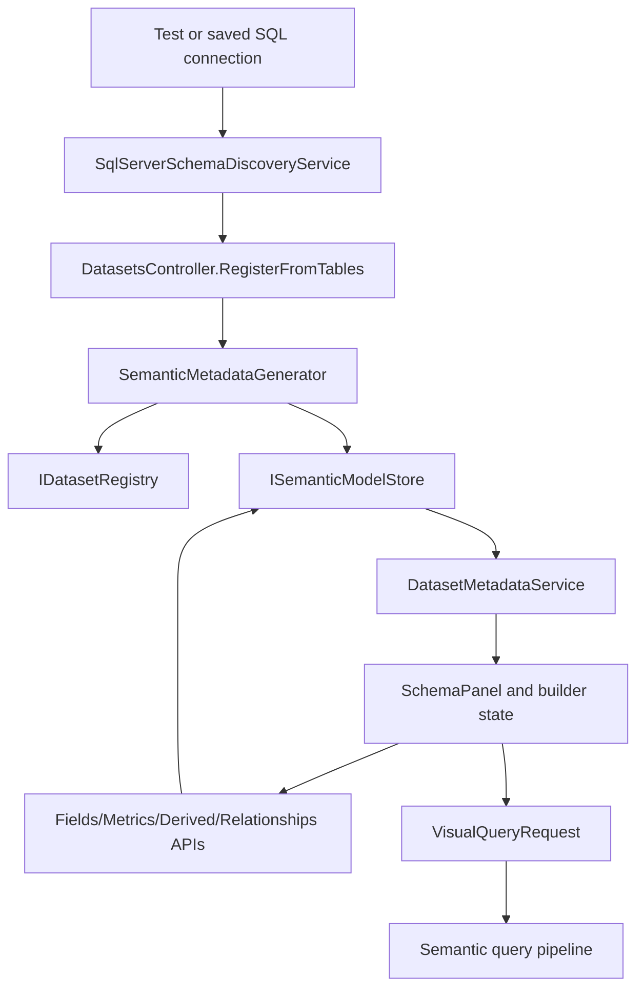

Metadata is created from SQL Server schema discovery and generated semantic classifications, stored in in-memory registries/stores, loaded through `ISemanticModelStore.LoadAsync`, mutated by `SemanticModelMutationService` and `DatasetRelationshipService`, consumed by metadata APIs and query engine stages, and cached only by the lifetime of singleton in-memory stores.

## 9. Query engine and SQL generation deep dive

### Visual query binding

`SemanticModelBinder.Bind` verifies row field ids, resolves values to model metrics or runtime aggregate metric ids, resolves dimension and metric filters, validates filter operators and scalar/list values, rejects hidden/unavailable fields, validates sort direction and duplicate sort fields, and returns `BoundSemanticQuery`.

### Evaluation context

`EvaluationContextBuilder.Build` transforms bound filters into `WhereFilters` for dimensions and `HavingFilters` for metrics. It preserves rows, measures, sort, limit, and offset.

### Measure expansion

`MeasureExpansionEngine.Expand` compiles each metric formula with `SemanticExpressionCompiler.CompileMetricFormula`, converts the display name to a safe SQL alias, and records the metric base table. Runtime aggregate metric ids are supported by the binder/factory path for frontend-selected aggregate columns.

### Relationship traversal and joins

`RelationshipTraversalEngine.Build` collects required tables from group fields, measures, and dimension filters. It chooses the first measure base table when present; otherwise it chooses a bridge table that can reach all requested tables, preferring fact tables and requested tables. It traverses only active `N:1` or `1:1` relationships, adding reverse edges for bidirectional or `1:1` relationships. It performs breadth-first path search, ranks equal-length paths by primary relationships, database foreign-key source, and confidence, and throws explicit validation errors for no path or ambiguous equally ranked paths.

### Logical planning

`LogicalPlanBuilder.Build` assigns table aliases, renders select expressions for dimensions and measures, turns join definitions into join items, generates `GROUP BY` when at least one measure and one group field exist, places dimension filters in `Where`, places metric filters in `Having`, maps sort rules to selected aliases or raw expressions, and carries limit/offset.

### SQL compilation

`SqlCompiler.Compile` renders T-SQL as `SELECT`, `FROM`, joins, `WHERE`, `GROUP BY`, `HAVING`, `ORDER BY`, and paging. Filter values are parameterized as `@p0`, `@p1`, etc. `IN` expands to multiple parameters, `BETWEEN` requires exactly two values, `CONTAINS` renders `LIKE '%' + @p + '%'`, `TOP` is used for limit without offset/order, and `OFFSET/FETCH` is used otherwise.

### Example shape

A request with rows `CustomerName`, values `TotalSales`, and filter `OrderDate >= 2026-01-01` becomes:

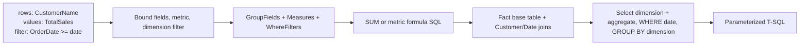

The exact SQL expression depends on the semantic model's physical table ids, column names, metric formula, and active relationships.

## 10. Frontend architecture

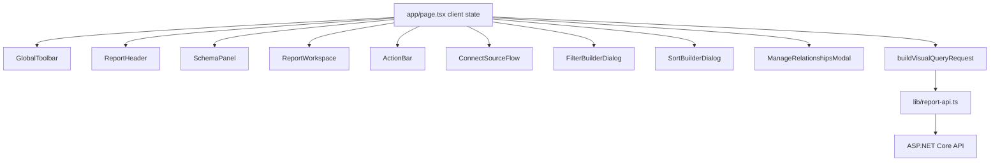

The primary page is a large client component that stores selected fields, calculated fields, filters, sorts, preview limit, metadata, active connection/dataset, run state, and export state. It persists connected source state to `localStorage` without the password. It loads metadata from `getDatasetMetadata`, builds runtime aggregate metric ids through `build-visual-query-request.ts`, executes reports through `executeReportQuery`, maps comprehensive responses to table rows and validation notifications, and exports using `renderReportExecution`.

State management is local React state and browser `localStorage`, not Redux/Zustand. API clients are small fetch wrappers in `data-report-builder/lib/*-api.ts`.

## 11. End-to-end flows

### Connect source / test connection / discover tables

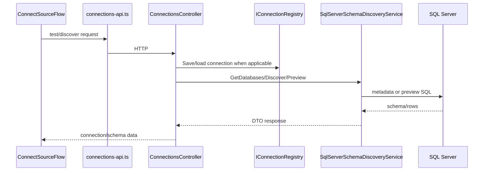

### Register dataset / load metadata

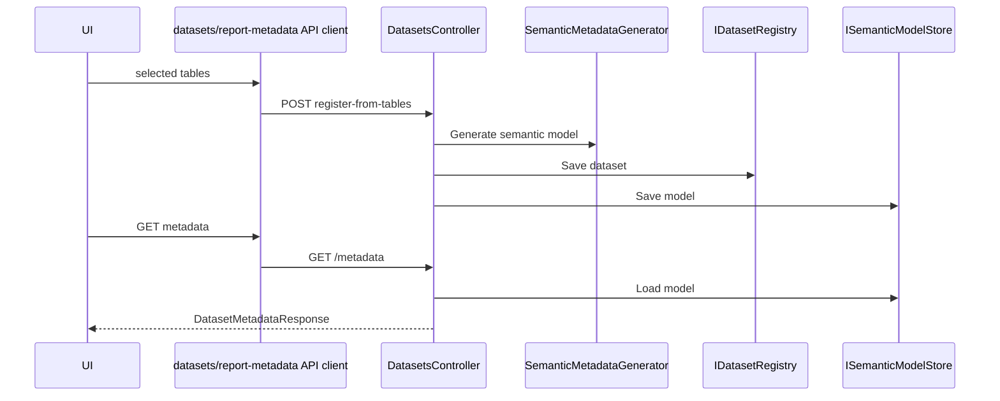

### Create relationships / measures / calculated columns

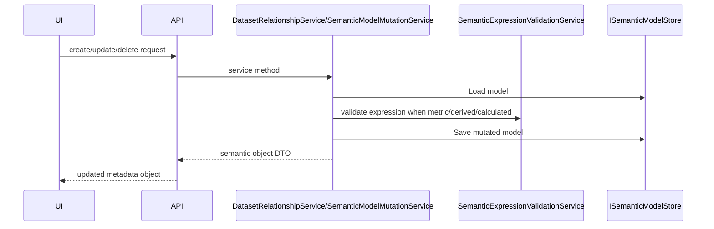

### Build, compile, execute, render report

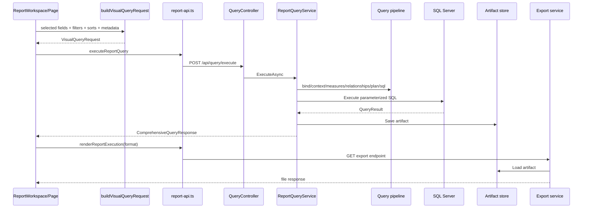

## 12. Test analysis

The repository currently contains no `Report.QueryEngine.Tests` project and no test files under `ReportPlatform`. This is a major gap because the highest-risk code is query planning and SQL generation. Existing validation classes provide runtime checks, but they are not a substitute for repeatable unit/integration tests.

Recommended missing test coverage:

- Binder validation for unknown/hidden fields, runtime aggregate metrics, bad filter values, bad operators, duplicate sorts, metric filters.
- Relationship traversal no-path, ambiguous-path, reverse bidirectional traversal, primary/FK/confidence ranking, base table choice.
- Logical plan generation for derived fields, metric HAVING, dimension WHERE, grouping and unselected sort fields.
- SQL compiler parameterization for all operators, paging, TOP, ORDER BY alias behavior.
- Expression tokenizer/parser/binder/compiler for nested functions, dependency cycles, aggregation legality.
- End-to-end query service with fake semantic model and fake executor.
- Infrastructure integration tests around SQL Server schema discovery and execution mapping.

## 13. Design patterns

- Dependency Injection: the API registers all stores, services, pipeline stages, validators, executors, artifact stores, and renderers in `Program.cs`. Benefit: pluggable implementations; limitation: many concrete query engine classes are directly registered instead of interface abstractions.
- Pipeline: query execution is staged from validation to binding to planning to SQL to execution. Benefit: clear conceptual phases; limitation: `ReportQueryService` has high orchestration responsibility.
- Registry/Store: in-memory registries for connection, dataset, report, execution, and semantic model state. Benefit: easy prototyping; limitation: volatile and not multi-instance safe.
- Builder: `EvaluationContextBuilder`, `LogicalPlanBuilder`, and `ReportArtifactBuilder`. Benefit: concentrated transformation logic; limitation: builders can accumulate policy decisions.
- Compiler: semantic expression compiler and SQL compiler convert abstract semantic requests into SQL strings. Benefit: separation of semantic and physical execution; limitation: string-based expression replacement is fragile.
- Strategy/Adapter: query executor, artifact stores, execution repositories, export services, and Power BI REST/auth services adapt external systems behind interfaces.

## 14. Performance review

Potential bottlenecks:

- In-memory stores and registries are not suitable for multi-node deployments or large metadata sets.
- Relationship traversal repeatedly filters relationship lists during BFS; indexing adjacency lists would reduce repeated scans.
- Logical plan alias replacement uses string replacement across expressions and could be fragile and inefficient for many tables/expressions.
- Query execution materializes all returned rows into dictionaries and also executes a second artifact query with `Limit=0`/`Offset=0`, which can duplicate database load and create large in-memory `DataTable` objects.
- Local artifact creation serializes full result sets; large reports need streaming, chunking, compression, quotas, and cancellation-aware IO.
- SQL compiler may generate `ORDER BY (SELECT NULL)` for offset-only paging; this is nondeterministic.

Recommendations:

1. Persist semantic metadata and reports in a durable store with optimistic concurrency and versioning.
2. Add relationship graph indexes per model/version.
3. Replace string SQL expression rewrites with AST/table-reference aware compilation.
4. Avoid double query execution by reusing the first result when possible or explicitly distinguishing preview execution from full artifact execution.
5. Add row limits, timeout controls, query cancellation, streaming exports, and telemetry.
6. Add compiled-query and semantic-model cache keyed by dataset/version.

## 15. Security review

Strengths:

- SQL filters are parameterized in `SqlCompiler`.
- SQL identifiers are quoted through `SqlIdentifier` helpers and aliases are sanitized.
- Frontend local storage removes connection passwords before persistence.
- API exception middleware centralizes error responses.

Risks:

- No authentication or authorization is visible on controllers; all endpoints appear publicly callable in the configured environment.
- Connection strings and Power BI configuration require careful secret handling; local JSON/config files must not contain production secrets.
- Query generation compiles semantic expressions into SQL strings; expression validation must be treated as a security boundary and fuzz-tested.
- Dynamic table/column identifiers from discovered metadata still require strict quoting and allow-listing.
- Report export and artifact retrieval need authorization checks by tenant/user/report.
- In-memory stores have no tenant isolation or audit trail.
- CORS development policy permits localhost ports broadly, acceptable only for local development.

Mitigations:

1. Add authentication and authorization policies on all controllers.
2. Introduce tenant/user ownership on connections, datasets, semantic models, reports, executions, and artifacts.
3. Store secrets in a secrets manager and encrypt persisted connection credentials.
4. Add expression/compiler fuzz tests and SQL allow-list validation.
5. Add rate limits, query timeouts, row caps, and audit logging.

## 16. Architectural review and roadmap

### Strengths

- Clear separation between API, contracts, metadata, infrastructure, and query engine.
- Query processing is conceptually modular and staged.
- Semantic model has first-class dimensions, measures, derived fields, and relationships.
- SQL generation uses parameters for user filter values.
- Frontend already models realistic report-builder interactions: metadata browsing, drag/drop selection, filters, sorts, calculated objects, relationships, execution, and export.

### Weaknesses and technical debt

- No test project exists despite the complexity of query planning.
- In-memory metadata stores prevent production-grade durability and horizontal scaling.
- `ReportQueryService` is large and performs orchestration, validation, execution record state transitions, duplicate compilation/execution, and artifact creation.
- `CompileAsync` is effectively unimplemented for `/api/query/compile`.
- Compile/query artifacts are built through a second compilation and second execution path.
- Expression-to-SQL logic uses strings rather than a typed SQL AST.
- Authentication/authorization is absent.
- Several placeholder `Class1.cs` files and stub-like storage (`S3ReportArtifactStore`) remain.

### Improvement roadmap

1. Add comprehensive query engine unit tests and API integration tests.
2. Implement durable metadata persistence with schema migrations and semantic model versioning.
3. Split `ReportQueryService` into query compiler, execution orchestrator, artifact orchestrator, and execution recorder.
4. Implement real `/api/query/compile` returning SQL, parameters, logical diagnostics, and validation results without execution.
5. Introduce typed SQL/expression ASTs and table-reference-aware aliasing.
6. Add authN/authZ, tenant isolation, encrypted secret storage, and audit logs.
7. Add query governance: max runtime, row limit, cancellation, concurrency limits, telemetry, and database workload tagging.
8. Productionize artifact stores including real cloud object storage implementations.
9. Add frontend state modularization and API error-boundary patterns.

## 17. Fact/assumption boundary

Facts in this document are derived from source files present in the repository at analysis time. Where the document says “recommended,” “risk,” or “deployment assumption,” it is an architectural interpretation based on source behavior, not a guarantee of how the system is deployed outside the repository.
## 18. Planned SQL Server semantic metadata persistence

A SQL Server DDL has been supplied for the next persistence phase. It is recorded in `docs/database/SEMANTIC_METADATA_SCHEMA_NOTES.md` as the target schema contract for replacing or supplementing the current in-memory semantic metadata stores. The schema covers semantic connections, datasets, model versions, selected tables, semantic tables, fields, metrics, semantic objects/dependencies, relationships, saved report definitions, audit log, metadata hydration views, indexes, and timestamp triggers.

Important current-state distinction: the running engine still uses in-memory `IConnectionRegistry`, `IDatasetRegistry`, `ISemanticModelStore`, and `IReportRegistry` implementations until SQL-backed implementations and DI configuration are added.
