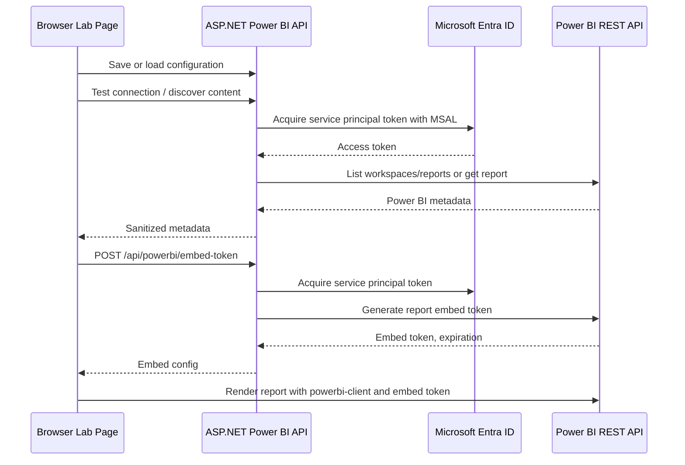

# Power BI Embedded Lab

## Overview

The Power BI Embedded Lab is an isolated test module for validating Power BI Embedded in App Owns Data mode. It does not use or modify the Telerik Reporting viewer, report execution engine, semantic query layer, query compiler, export pipeline, artifact storage, or existing reporting APIs.

Backend module boundary:

- `Report.Api/Controllers/PowerBI`
- `Report.Api/Services/PowerBI`
- `Report.Api/DTOs/PowerBI`
- `Report.Api/Options/PowerBI`
- `Report.Api/Validators/PowerBI`

Frontend module boundary:

- `data-report-builder/app/powerbi-embed-lab`
- `data-report-builder/components/powerbi`
- `data-report-builder/lib/powerbi-api.ts`

Official Microsoft references:

- Service principal embedding: https://learn.microsoft.com/power-bi/developer/embedded/embed-service-principal
- App owns data tutorial: https://learn.microsoft.com/power-bi/developer/embedded/embed-sample-for-customers
- Embed tokens: https://learn.microsoft.com/power-bi/developer/embedded/embed-tokens
- JavaScript events: https://learn.microsoft.com/javascript/api/overview/powerbi/handle-events
- Power BI REST API: https://learn.microsoft.com/rest/api/power-bi/

## Prerequisites

- A Microsoft Entra tenant.
- A Power BI Pro or Premium Per User license for publishing and setup.
- Power BI Embedded capacity, Fabric capacity, or Power BI Premium capacity for production embedding.
- A workspace containing at least one report.
- A Microsoft Entra app registration configured as a service principal.
- Power BI tenant settings that allow service principals to use Power BI APIs.
- The service principal must have workspace access.

## Microsoft Entra Setup

1. Open Microsoft Entra admin center.
2. Go to **App registrations**.
3. Create a new app registration.
4. Copy the **Directory (tenant) ID** into `TenantId`.
5. Copy the **Application (client) ID** into `ClientId`.
6. Open **Certificates & secrets**.
7. Create a client secret.
8. Copy the secret value immediately into `ClientSecret`.

For service principal embedding, Microsoft recommends avoiding unused delegated or application API permissions on this app registration. The backend uses MSAL client credentials with this scope:

```text
https://analysis.windows.net/powerbi/api/.default
```

## Power BI Admin Portal Setup

1. Open Power BI Admin Portal.
2. Go to **Tenant settings**.
3. Enable **Allow service principals to use Power BI APIs**.
4. Scope the setting to a dedicated security group.
5. Add the Entra app service principal to that security group.
6. Wait for tenant setting propagation.
7. Validate that the service principal can list or access the target workspace through the lab connection test.

## Workspace Setup

1. Open the Power BI workspace.
2. Select **Manage access**.
3. Add the service principal or its security group.
4. Grant at least **Member** or **Admin** for broad testing, or the minimum role that supports the target embed workflow.
5. Copy the workspace ID from the workspace URL.

Example workspace URL:

```text
https://app.powerbi.com/groups/{workspaceId}/list
```

## Report Setup

1. Open the target report in the workspace.
2. Copy the report ID from the report URL.
3. Locate the dataset ID through the Power BI service, REST API, or the lab's dataset discovery endpoint.
4. Confirm the service principal has access to both report and dataset.
5. Confirm the report returns an `embedUrl` from the REST API.

Example report URL:

```text
https://app.powerbi.com/groups/{workspaceId}/reports/{reportId}/ReportSection
```

## Application Configuration

The backend supports `appsettings.json`, user secrets, local lab config, and environment variables. Environment variables override all other sources.

### Environment Variables

```powershell
$env:POWERBI_TENANT_ID = "00000000-0000-0000-0000-000000000000"
$env:POWERBI_CLIENT_ID = "00000000-0000-0000-0000-000000000000"
$env:POWERBI_CLIENT_SECRET = "<secret>"
$env:POWERBI_WORKSPACE_ID = "00000000-0000-0000-0000-000000000000"
$env:POWERBI_REPORT_ID = "00000000-0000-0000-0000-000000000000"
$env:POWERBI_DATASET_ID = "00000000-0000-0000-0000-000000000000"
```

Optional:

```powershell
$env:POWERBI_AUTHORITY_URL = "https://login.microsoftonline.com"
$env:POWERBI_API_BASE_URL = "https://api.powerbi.com/v1.0/myorg"
```

### appsettings.json

```json
{
  "PowerBI": {
    "TenantId": "",
    "ClientId": "",
    "ClientSecret": "",
    "WorkspaceId": "",
    "ReportId": "",
    "DatasetId": "",
    "AuthorityUrl": "https://login.microsoftonline.com",
    "ApiBaseUrl": "https://api.powerbi.com/v1.0/myorg"
  }
}
```

Do not commit real secrets to `appsettings.json`.

### User Secrets

From `ReportPlatform/Report.Api`:

```powershell
dotnet user-secrets init
dotnet user-secrets set "PowerBI:TenantId" "00000000-0000-0000-0000-000000000000"
dotnet user-secrets set "PowerBI:ClientId" "00000000-0000-0000-0000-000000000000"
dotnet user-secrets set "PowerBI:ClientSecret" "<secret>"
dotnet user-secrets set "PowerBI:WorkspaceId" "00000000-0000-0000-0000-000000000000"
dotnet user-secrets set "PowerBI:ReportId" "00000000-0000-0000-0000-000000000000"
```

### Lab UI Persistence

The lab UI saves editable settings through:

```text
POST /api/powerbi/config/save
```

By default, the backend persists lab settings outside the repository under the current user's application data directory:

```text
%APPDATA%\ReportPlatform\PowerBIEmbedLab\powerbi-settings.local.json
```

Set `PowerBI:LocalConfigurationPath` to override that location.

## Running Backend

From `ReportPlatform/Report.Api`:

```powershell
dotnet restore
dotnet run
```

Expected result:

- API starts on the configured ASP.NET URL.
- Swagger is available.
- Power BI endpoints are available under `/api/powerbi`.

Validation:

```powershell
curl http://localhost:5224/api/powerbi/config
```

## Running Frontend

From `data-report-builder`:

```powershell
pnpm install
pnpm dev
```

Open:

```text
http://localhost:3000/powerbi-embed-lab
```

If the backend is not on `http://localhost:5224`, set:

```powershell
$env:NEXT_PUBLIC_REPORT_API_URL = "http://localhost:<backend-port>"
```

Expected result:

- The lab page loads.
- Configuration can be edited.
- Client Secret is masked after loading.
- Access token and embed token are never displayed.

## Testing APIs

### Load Configuration

```powershell
curl http://localhost:5224/api/powerbi/config
```

### Save Configuration

```powershell
curl -X POST http://localhost:5224/api/powerbi/config/save `
  -H "Content-Type: application/json" `
  -d "{\"tenantId\":\"00000000-0000-0000-0000-000000000000\",\"clientId\":\"00000000-0000-0000-0000-000000000000\",\"clientSecret\":\"<secret>\",\"workspaceId\":\"00000000-0000-0000-0000-000000000000\",\"reportId\":\"00000000-0000-0000-0000-000000000000\",\"datasetId\":\"\",\"authorityUrl\":\"https://login.microsoftonline.com\",\"apiBaseUrl\":\"https://api.powerbi.com/v1.0/myorg\"}"
```

### Test Connection

```powershell
curl -X POST http://localhost:5224/api/powerbi/test-connection -H "Content-Type: application/json" -d "{}"
```

### Discover Workspaces

```powershell
curl http://localhost:5224/api/powerbi/workspaces
```

### Discover Reports

```powershell
curl http://localhost:5224/api/powerbi/workspaces/{workspaceId}/reports
```

### Get Report Details

```powershell
curl http://localhost:5224/api/powerbi/workspaces/{workspaceId}/reports/{reportId}
```

### Discover Datasets

```powershell
curl http://localhost:5224/api/powerbi/workspaces/{workspaceId}/datasets
```

### Generate Embed Token

```powershell
curl -X POST http://localhost:5224/api/powerbi/embed-token `
  -H "Content-Type: application/json" `
  -d "{\"workspaceId\":\"00000000-0000-0000-0000-000000000000\",\"reportId\":\"00000000-0000-0000-0000-000000000000\",\"datasetId\":\"\"}"
```

The response contains `embedToken` for browser embedding. Do not log or persist it.

## Embedding Workflow



## Troubleshooting

### Unauthorized

Root causes:

- Invalid tenant ID.
- Invalid client ID.
- Invalid client secret.
- Secret expired.
- Service principal disabled.

Fixes:

- Recreate the client secret.
- Verify tenant and client IDs.
- Confirm the app registration exists in the expected tenant.

### Forbidden

Root causes:

- Service principal API access disabled in Power BI Admin Portal.
- Service principal is not in the allowed security group.
- Service principal has no workspace permission.

Fixes:

- Enable service principal access in tenant settings.
- Add the service principal or app security group.
- Add the service principal to the workspace.

### Workspace Not Found

Root causes:

- Wrong workspace ID.
- Workspace is in another tenant.
- Service principal cannot see the workspace.

Fixes:

- Copy the workspace ID from the Power BI URL.
- Re-run workspace discovery.
- Check workspace access.

### Report Not Found

Root causes:

- Wrong report ID.
- Report moved or deleted.
- Service principal can access workspace but not content.

Fixes:

- Re-run report discovery.
- Copy the report ID from the workspace report URL.
- Validate report exists in the configured workspace.

### Token Generation Failed

Root causes:

- Report has no valid dataset.
- Dataset requires effective identity or RLS configuration.
- Capacity or licensing prerequisites are missing.
- Service principal lacks dataset access.

Fixes:

- Discover datasets and provide the dataset ID.
- Validate RLS requirements.
- Confirm capacity/licensing.
- Grant workspace permission to the service principal.

### Service Principal Not Enabled

Root causes:

- Power BI tenant setting is off.
- Security group scoping excludes the app.

Fixes:

- Enable **Allow service principals to use Power BI APIs**.
- Add the app registration service principal to the configured security group.
- Wait for setting propagation.

### SDK Initialization Failure

Root causes:

- `powerbi-client` package missing.
- Browser blocked script execution.
- Invalid embed URL or token.

Fixes:

- Run `pnpm install`.
- Regenerate the embed token.
- Confirm `embedUrl` is present in report details.

### Network Failure

Root causes:

- Backend API URL is wrong.
- CORS origin is not allowed.
- Backend is not running.

Fixes:

- Set `NEXT_PUBLIC_REPORT_API_URL`.
- Add frontend origin to `Cors:AllowedOrigins`.
- Restart backend.

## Security Notes

- Use environment variables, user secrets, or a managed secret store for production.
- Prefer certificate authentication over client secrets for production service principals.
- Do not log access tokens, embed tokens, or client secrets.
- Embed tokens should be short-lived and generated on demand.
- Scope service principal workspace permissions to the minimum required.
- Restrict the lab route before exposing it outside a trusted development environment.
- Store any persisted lab settings outside source control.
- Review audit logs for service principal access.
